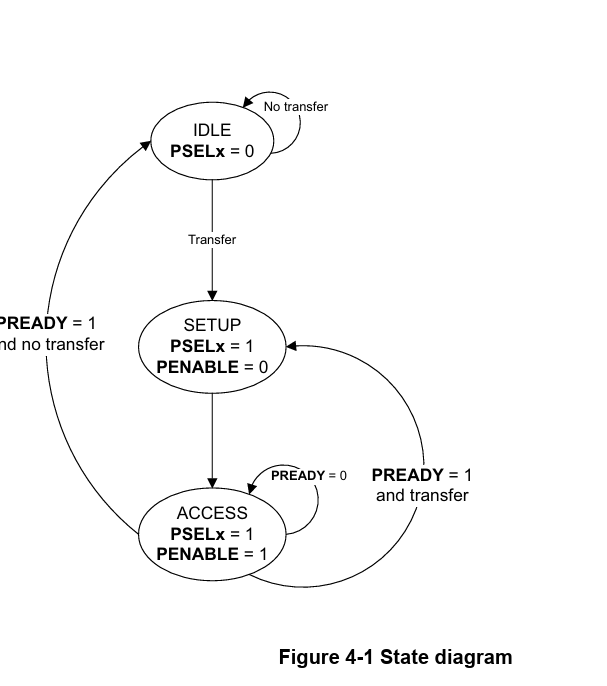
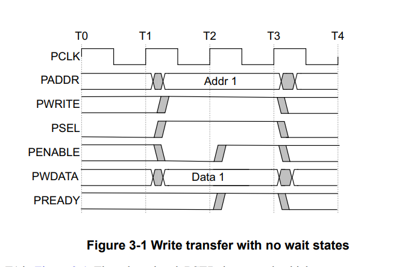
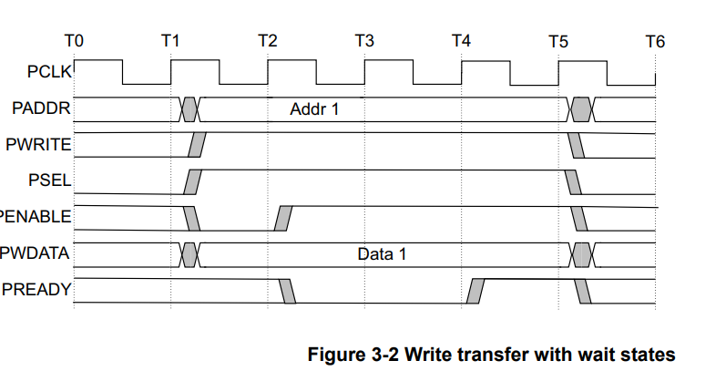

# AMBA--APB  
## Introduction of AMBA ***:

AMBA is an open specification that specifies a strategy on the management of the functional blocks that sort system on chip (SoC) architecture.
The AMBA specification standard is used for designing high-level embedded microcontrollers.
AMBA’s major objective is to provide technology independence and to encourage modular system design. Furthermore, it strongly encourages the development of reusable peripheral devices while minimizing silicon infrastructure. 

Today,  AMBA is widely used on a range of ASIC and SoC parts including applications processors used in modern portable mobile devices like smartphones.
AMBA was introduced by ARM in 1996. The first AMBA buses were the Advanced System Bus (ASB) and the Advanced Peripheral Bus (APB).

In its second version, AMBA 2 in 1999, ARM added AMBA High-performance Bus (AHB) that is a single clock-edge protocol.
In 2003, ARM introduced the third generation, AMBA 3, including Advanced eXtensible Interface (AXI) to reach even higher performance interconnect and the Advanced Trace Bus (ATB) as part of the CoreSight on-chip debug and trace solution.

In 2010, the AMBA 4 specifications were introduced starting with AMBA 4 AXI4, then
in 2011, extending system-wide coherency with AMBA 4 AXI Coherency Extensions (ACE).
In 2013, the AMBA 5 Coherent Hub Interface (CHI) specification was introduced, with a re-designed high-speed transport layer and features designed to reduce congestion.

The APB protocol is a low-cost interface, optimized for minimal power consumption and reduced interface
complexity. The APB interface is not pipelined and is a simple, synchronous protocol. Every transfer takes at least
two cycles to complete.

The APB interface is designed for accessing the programmable control registers of peripheral devices. APB
peripherals are typically connected to the main memory system using an APB bridge. For example, a bridge from
AXI to APB could be used to connect a number of APB peripherals to an AXI memory system. 

APB transfers are initiated by an APB bridge. APB bridges can also be referred to as a Requester. A peripheral
interface responds to requests. APB peripherals can also be referred to as a Completer. This specification will use
Requester and Completer

## TYPES OF AMBA bus*** :
1. Five interfaces are defined within the AMBA specification: 
2. Advanced system bus (ASB)
3. Advanced peripheral bus (APB)
4. Advanced high-performance bus (AHB)
5. Advanced extensible interface (AXI)
6. Advanced trace bus (ATB).

## APB -BLOCK DIAGRAM ***:
   

## APB - SLGS :
**PCLK Clock:**  The rising edge of PCLK times all transfers on the APB.

**PRESET:** System bus equivalent Reset. The APB reset signal is active LOW.

**PADDR:** 32 bit address bus PSEL The slave device is selected and that a data transfer is required.

**PENABLE Enable:** This signal indicates the second and subsequent cycles of an APB transfer.

**PWRITE:** Access when HIGH.

**PWDATA:** 32 bits Write data PWRITE is HIGH.

**PREADY:** Ready To extend an APB transfer.

**PRDATA:** 32 bits Read data and PWRITE is LOW.

**PSLAVERR:** Slave error: This signal indicates a transfer failure.

## Operating States of APB

 
The state machine operates through the following states: 

**IDLE:** This is the default state of the APB interface.

**SETUP:** When a transfer is required, the interface moves into the SETUP state, where the appropriate select
signal, PSELx, is asserted. The interface only remains in the SETUP state for one clock cycle and
always moves to the ACCESS state on the next rising edge of the clock.

**ACCESS:** The enable signal, PENABLE, is asserted in the ACCESS state. The following signals must not
change in the transition between SETUP and ACCESS and between cycles in the ACCESS state:
                  
- **PADDR**

- **PPROT**

- **PWRITE**

- **PWDATA**, only for write transactions

- **PSTRB**

- **PAUSER**

- **PWUSER**

Exit from the ACCESS state is controlled by the PREADY signal from the Completer:

- **If PREADY**  is held LOW by the Completer, then the interface remains in the ACCESS state.

- **If PREADY** is driven HIGH by the Completer, then the ACCESS state is exited and the bus returns to the IDLE state if no more transfers are required. 

Alternatively, the bus moves directly to the SETUP state if another transfer follows.   

## WRITE TRANSFERS:

This section describes the following types of write transfer:

• With no wait states

• With wait states

All signals shown in this section are sampled at the rising edge of PCLK.

## With no wait states:

- The Setup phase of the write transfer occurs at T1 .The select signal, PSEL, is asserted, which means
that PADDR, PWRITE, and PWDATA must be valid.

- The Access phase of the write transfer is shown at T2 in Figure 3-1 where PENABLE is asserted. PREADY is
asserted by the Completer at the rising edge of PCLK to indicate that the write data will be accepted at T3. PADDR,
PWDATA, and any other control signals, must be stable until the transfer completes.

- At the end of the transfer, PENABLE is deasserted. PSEL is also deasserted, unless there is another transfer to the
same peripheral.

## Wait wait states:

During an Access phase, when PENABLE is HIGH, the Completer extends the transfer by driving PREADY LOW.
The following signals remain unchanged while PREADY remains LOW: 

Address signal, PADDR
• Direction signal, ## PWRITE
• Select signal, PSELx
• Enable signal, PENABLE
• Write data signal, PWDATA
• Write strobe signal, PSTRB
• Protection type signal, PPROT
• User request attribute, PAUSER
• User write data attribute, PWUSER

